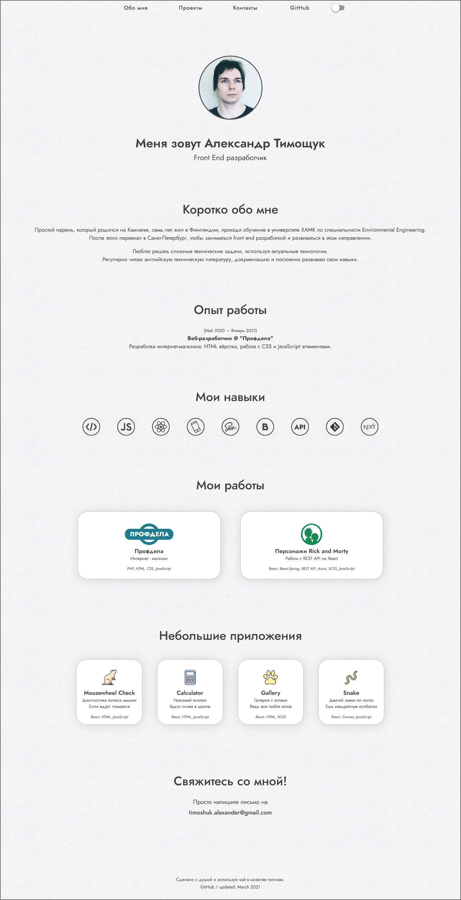

# Personal Web Page

Just a personal web page built with <b>React</b>, <b>React-Router</b>, <b>SCSS</b>, <b>JavaScript</b>
and little bit of love.

Provides information about me and my coding skills by showcasing my personal projects:

- <b>Rick and Morty characters</b>  
  The application demonstrates working with REST API in React by using an external API.  
  Also has some additional functionality such as Dark Mode, 3D Card and infinite scrolling.  
  Stack: *React, React-Router, Axios, React-Spring, SCSS, JavaScript* 
  

- <b>Mousewheel Checker</b>  
  A small utility for checking my broken mouse wheel by using JavaScript.  
  Just scroll your wheel (broken or not) and watch the mouse reacting to it by moving its tail. 
  Stack: *React, HTML, SCSS, JavaScript*

- <b>Calculator</b> 
  A simple calculator to do your maths.  
  You should know what to do with it.  
  Stack: *React, HTML, SCSS, JavaScript*

- <b>Snake game</b>  
  Just eat those red cubes and grow your snake.  
  Stack: *React, HTML, SCSS and JavaScript*  

- <b>Gallery</b>  
  Check out those nice pictures of animals.  
  Stack: *React, SCSS*  

  

